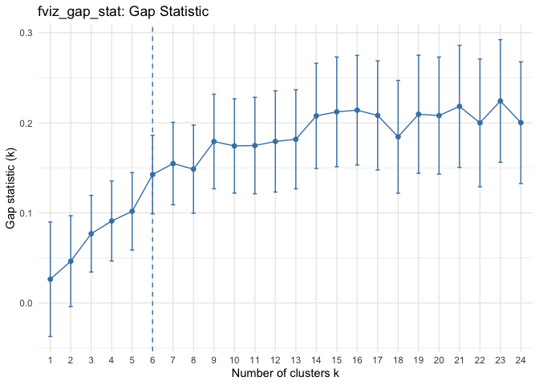
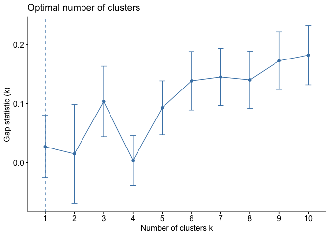
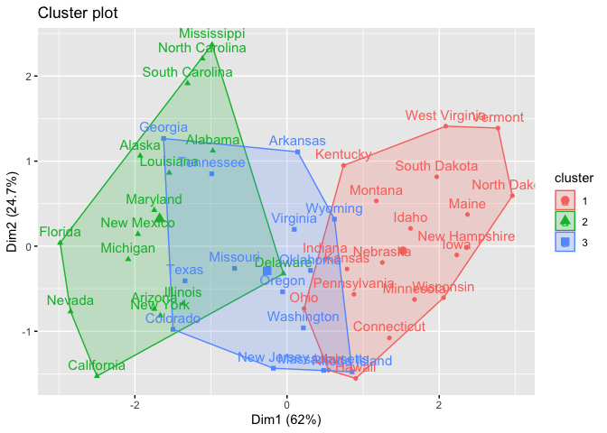

Assignment 4
================
Megan Marziali
Feb 3, 2021

## Part 1: Implementing a Simple Prediction Pipeline

### Problem set-up

##### Loading required paackages

The following code chunk loads the required packages for the assignment.

``` r
library(tidyverse)
library(Amelia)
library(caret)
library(stats)
library(factoextra)
library(cluster)
```

##### Loading data into environment and cleaning

``` r
nyc_data = 
  read.csv("./data/class4_p1.csv", na = c("", ".", "NA")) %>% 
  janitor::clean_names() %>%
  mutate(
    bmi = as.numeric(bmi),
    gpaq8totmin = as.numeric(gpaq8totmin),
    gpaq11days = as.integer(gpaq11days),
    healthydays = as.integer(healthydays)
  )

summary(nyc_data)
```

    ##        x             chronic1       chronic3        chronic4    
    ##  Min.   :   1.0   Min.   :1.00   Min.   :1.000   Min.   :1.000  
    ##  1st Qu.: 953.5   1st Qu.:1.00   1st Qu.:2.000   1st Qu.:2.000  
    ##  Median :1906.0   Median :2.00   Median :2.000   Median :2.000  
    ##  Mean   :1906.0   Mean   :1.71   Mean   :1.888   Mean   :1.938  
    ##  3rd Qu.:2858.5   3rd Qu.:2.00   3rd Qu.:2.000   3rd Qu.:2.000  
    ##  Max.   :3811.0   Max.   :2.00   Max.   :2.000   Max.   :2.000  
    ##                   NA's   :28     NA's   :17      NA's   :8      
    ##       bmi           tobacco1        alcohol1      gpaq8totmin    
    ##  Min.   : 9.09   Min.   :1.000   Min.   :1.000   Min.   :  0.00  
    ##  1st Qu.:23.05   1st Qu.:3.000   1st Qu.:2.000   1st Qu.:  0.00  
    ##  Median :26.47   Median :3.000   Median :3.000   Median :  0.00  
    ##  Mean   :27.32   Mean   :2.736   Mean   :2.642   Mean   : 43.77  
    ##  3rd Qu.:30.23   3rd Qu.:3.000   3rd Qu.:3.000   3rd Qu.: 60.00  
    ##  Max.   :99.83   Max.   :3.000   Max.   :3.000   Max.   :960.00  
    ##  NA's   :73      NA's   :3       NA's   :17      NA's   :5       
    ##    gpaq11days       habits5         habits7         agegroup    
    ##  Min.   :0.000   Min.   :1.000   Min.   :1.000   Min.   :1.000  
    ##  1st Qu.:2.000   1st Qu.:1.000   1st Qu.:2.000   1st Qu.:2.000  
    ##  Median :5.000   Median :2.000   Median :3.000   Median :3.000  
    ##  Mean   :4.273   Mean   :1.972   Mean   :2.734   Mean   :2.781  
    ##  3rd Qu.:7.000   3rd Qu.:2.000   3rd Qu.:3.000   3rd Qu.:3.000  
    ##  Max.   :7.000   Max.   :4.000   Max.   :5.000   Max.   :4.000  
    ##  NA's   :5       NA's   :17      NA's   :1335    NA's   :8      
    ##       dem3            dem4            dem8        povertygroup  healthydays   
    ##  Min.   :1.000   Min.   :1.000   Min.   :1.000   Min.   :1.0   Min.   : 0.00  
    ##  1st Qu.:1.000   1st Qu.:2.000   1st Qu.:1.000   1st Qu.:2.0   1st Qu.:27.00  
    ##  Median :2.000   Median :2.000   Median :1.000   Median :3.0   Median :30.00  
    ##  Mean   :1.594   Mean   :1.777   Mean   :1.386   Mean   :3.3   Mean   :26.34  
    ##  3rd Qu.:2.000   3rd Qu.:2.000   3rd Qu.:2.000   3rd Qu.:5.0   3rd Qu.:30.00  
    ##  Max.   :2.000   Max.   :2.000   Max.   :2.000   Max.   :6.0   Max.   :30.00  
    ##                  NA's   :30      NA's   :6       NA's   :244   NA's   :88

``` r
nrow(nyc_data)
```

    ## [1] 3811

``` r
missmap(nyc_data, main = "Missing values vs observed")
```

<!-- -->

Based on missingness, I would not include the variables “habits7” and
“povertygroup” in any models. I would also remove all missingness from
variables that I intend to keep in models. With all variables and
missing observations included, the total N for the dataset is 3811.

``` r
nyc_restr = 
  select(nyc_data, -habits7, -povertygroup) %>% 
  na.omit()

nrow(nyc_restr)
```

    ## [1] 3552

After removing the variables “habits7” and “povertygroup”, and deleting
missing observations, the total N for the dataset is 3552.

##### Data partitioning

``` r
set.seed(100)

train.indices = createDataPartition(y = nyc_restr$healthydays,p = 0.7,list = FALSE)

training = nyc_restr[train.indices,]
testing = nyc_restr[-train.indices,]
```

### Problem 1:

Fit two prediction models using different subsets of the features in the
training data. Features can overlap in the two models, but the feature
sets should not be exactly the same across models. Clearly state which
features were used in the two models.

``` r
model_1 <- lm(healthydays ~ chronic1 + chronic3 + chronic4 + bmi + gpaq8totmin + gpaq11days + habits5 + dem3, data = training)
summary(model_1)
```

    ## 
    ## Call:
    ## lm(formula = healthydays ~ chronic1 + chronic3 + chronic4 + bmi + 
    ##     gpaq8totmin + gpaq11days + habits5 + dem3, data = training)
    ## 
    ## Residuals:
    ##      Min       1Q   Median       3Q      Max 
    ## -29.6331   0.3866   2.0994   3.5958  11.3321 
    ## 
    ## Coefficients:
    ##              Estimate Std. Error t value Pr(>|t|)    
    ## (Intercept) 16.597303   2.023526   8.202 3.75e-16 ***
    ## chronic1     2.169564   0.359629   6.033 1.85e-09 ***
    ## chronic3     2.214862   0.519365   4.265 2.08e-05 ***
    ## chronic4     2.988871   0.649312   4.603 4.37e-06 ***
    ## bmi         -0.050116   0.025593  -1.958  0.05032 .  
    ## gpaq8totmin  0.001162   0.001697   0.685  0.49339    
    ## gpaq11days   0.150963   0.058346   2.587  0.00973 ** 
    ## habits5     -1.295627   0.193862  -6.683 2.88e-11 ***
    ## dem3        -0.451693   0.307560  -1.469  0.14206    
    ## ---
    ## Signif. codes:  0 '***' 0.001 '**' 0.01 '*' 0.05 '.' 0.1 ' ' 1
    ## 
    ## Residual standard error: 7.481 on 2478 degrees of freedom
    ## Multiple R-squared:  0.08678,    Adjusted R-squared:  0.08383 
    ## F-statistic: 29.44 on 8 and 2478 DF,  p-value: < 2.2e-16

``` r
model_2 <- lm(healthydays ~ tobacco1 + alcohol1 + bmi + gpaq8totmin + gpaq11days + habits5 + dem3, data = training)
summary(model_2)
```

    ## 
    ## Call:
    ## lm(formula = healthydays ~ tobacco1 + alcohol1 + bmi + gpaq8totmin + 
    ##     gpaq11days + habits5 + dem3, data = training)
    ## 
    ## Residuals:
    ##      Min       1Q   Median       3Q      Max 
    ## -29.7803   0.3876   2.3832   3.8323  10.3809 
    ## 
    ## Coefficients:
    ##               Estimate Std. Error t value Pr(>|t|)    
    ## (Intercept) 32.9718396  1.2995072  25.373  < 2e-16 ***
    ## tobacco1     0.4614780  0.2397705   1.925  0.05439 .  
    ## alcohol1    -0.8509997  0.2904958  -2.929  0.00343 ** 
    ## bmi         -0.1078506  0.0252491  -4.271 2.02e-05 ***
    ## gpaq8totmin  0.0005348  0.0017175   0.311  0.75551    
    ## gpaq11days   0.1913265  0.0591128   3.237  0.00123 ** 
    ## habits5     -1.4746880  0.1962857  -7.513 8.02e-14 ***
    ## dem3        -0.3819569  0.3168549  -1.205  0.22814    
    ## ---
    ## Signif. codes:  0 '***' 0.001 '**' 0.01 '*' 0.05 '.' 0.1 ' ' 1
    ## 
    ## Residual standard error: 7.607 on 2479 degrees of freedom
    ## Multiple R-squared:  0.05533,    Adjusted R-squared:  0.05266 
    ## F-statistic: 20.74 on 7 and 2479 DF,  p-value: < 2.2e-16

### Problem 2:

Apply both models within the test data and determine which model is the
preferred prediction model using the appropriate evaluation metric(s).

``` r
model_1_test = lm(healthydays ~ chronic1 + chronic3 + chronic4 + bmi + gpaq8totmin + gpaq11days + habits5 + dem3, data = testing)
summary(model_1_test)
```

    ## 
    ## Call:
    ## lm(formula = healthydays ~ chronic1 + chronic3 + chronic4 + bmi + 
    ##     gpaq8totmin + gpaq11days + habits5 + dem3, data = testing)
    ## 
    ## Residuals:
    ##      Min       1Q   Median       3Q      Max 
    ## -29.6935  -0.0643   1.7542   3.6952  15.1966 
    ## 
    ## Coefficients:
    ##              Estimate Std. Error t value Pr(>|t|)    
    ## (Intercept) 11.644497   2.740911   4.248 2.34e-05 ***
    ## chronic1     3.121997   0.536649   5.818 7.91e-09 ***
    ## chronic3     1.450166   0.762928   1.901   0.0576 .  
    ## chronic4     5.754809   0.922236   6.240 6.32e-10 ***
    ## bmi         -0.013702   0.036236  -0.378   0.7054    
    ## gpaq8totmin -0.001388   0.002487  -0.558   0.5770    
    ## gpaq11days   0.106914   0.087204   1.226   0.2205    
    ## habits5     -1.762960   0.281285  -6.268 5.34e-10 ***
    ## dem3        -0.714068   0.458952  -1.556   0.1200    
    ## ---
    ## Signif. codes:  0 '***' 0.001 '**' 0.01 '*' 0.05 '.' 0.1 ' ' 1
    ## 
    ## Residual standard error: 7.352 on 1056 degrees of freedom
    ## Multiple R-squared:  0.1495, Adjusted R-squared:  0.143 
    ## F-statistic:  23.2 on 8 and 1056 DF,  p-value: < 2.2e-16

``` r
model_2_test = lm(healthydays ~ tobacco1 + alcohol1 + bmi + gpaq8totmin + gpaq11days + habits5 + dem3, data = testing)
summary(model_2_test)
```

    ## 
    ## Call:
    ## lm(formula = healthydays ~ tobacco1 + alcohol1 + bmi + gpaq8totmin + 
    ##     gpaq11days + habits5 + dem3, data = testing)
    ## 
    ## Residuals:
    ##      Min       1Q   Median       3Q      Max 
    ## -29.6143   0.1812   2.1979   3.9066  12.0326 
    ## 
    ## Coefficients:
    ##              Estimate Std. Error t value Pr(>|t|)    
    ## (Intercept) 34.251675   1.957066  17.502  < 2e-16 ***
    ## tobacco1     0.684645   0.378467   1.809  0.07074 .  
    ## alcohol1    -1.262148   0.446293  -2.828  0.00477 ** 
    ## bmi         -0.075462   0.036974  -2.041  0.04151 *  
    ## gpaq8totmin -0.001572   0.002581  -0.609  0.54261    
    ## gpaq11days   0.138536   0.090553   1.530  0.12634    
    ## habits5     -2.075579   0.289589  -7.167 1.43e-12 ***
    ## dem3        -0.580140   0.489222  -1.186  0.23595    
    ## ---
    ## Signif. codes:  0 '***' 0.001 '**' 0.01 '*' 0.05 '.' 0.1 ' ' 1
    ## 
    ## Residual standard error: 7.639 on 1057 degrees of freedom
    ## Multiple R-squared:  0.08094,    Adjusted R-squared:  0.07485 
    ## F-statistic:  13.3 on 7 and 1057 DF,  p-value: < 2.2e-16

``` r
mse_1 = sum(model_1_test$residuals^2)
mse_2 = sum(model_2_test$residuals^2)
```

The outcome we are investigating is continuous, so the appropriate
evaluation metric is to assess mean squared error. As model 1 has the
smaller mean squared error, we can determine that model 1 is the
preferred prediction model.

### Problem 3

The implementation of this model would be helpful if in cases where we
are trying to identify factors to intervene on to increase the number of
healthy days experienced. As the model works to identify predictors of a
higher number of healthy days, we know that those predictors function to
increase healthy days experienced.

## Part II

### Problem set-up

``` r
data("USArrests")
head(USArrests)
```

    ##            Murder Assault UrbanPop Rape
    ## Alabama      13.2     236       58 21.2
    ## Alaska       10.0     263       48 44.5
    ## Arizona       8.1     294       80 31.0
    ## Arkansas      8.8     190       50 19.5
    ## California    9.0     276       91 40.6
    ## Colorado      7.9     204       78 38.7

``` r
#Removing missing
us_arrest = na.omit(USArrests)

colMeans(us_arrest, na.rm = TRUE)
```

    ##   Murder  Assault UrbanPop     Rape 
    ##    7.788  170.760   65.540   21.232

``` r
apply(us_arrest, 2, sd, na.rm = TRUE)
```

    ##    Murder   Assault  UrbanPop      Rape 
    ##  4.355510 83.337661 14.474763  9.366385

``` r
# Data should be scaled???
```

I have opted not to scale the data because they are all in the same
units.

We can use the kmeans function in order to identify clusters within the
data, based on the three variables.

``` r
set.seed(100)
clusters = kmeans(us_arrest, 5, nstart = 25)
str(clusters)
```

    ## List of 9
    ##  $ cluster     : Named int [1:50] 5 5 2 3 5 3 1 5 2 3 ...
    ##   ..- attr(*, "names")= chr [1:50] "Alabama" "Alaska" "Arizona" "Arkansas" ...
    ##  $ centers     : num [1:5, 1:4] 5.59 11.95 8.21 2.95 11.77 ...
    ##   ..- attr(*, "dimnames")=List of 2
    ##   .. ..$ : chr [1:5] "1" "2" "3" "4" ...
    ##   .. ..$ : chr [1:4] "Murder" "Assault" "UrbanPop" "Rape"
    ##  $ totss       : num 355808
    ##  $ withinss    : num [1:5] 1480 2546 9137 4548 6706
    ##  $ tot.withinss: num 24417
    ##  $ betweenss   : num 331391
    ##  $ size        : int [1:5] 10 4 14 10 12
    ##  $ iter        : int 2
    ##  $ ifault      : int 0
    ##  - attr(*, "class")= chr "kmeans"

``` r
fviz_cluster(clusters, data = us_arrest)
```

<!-- -->

``` r
#Show the mean value of features within each cluster
clusters$centers
```

    ##      Murder  Assault UrbanPop     Rape
    ## 1  5.590000 112.4000 65.60000 17.27000
    ## 2 11.950000 316.5000 68.00000 26.70000
    ## 3  8.214286 173.2857 70.64286 22.84286
    ## 4  2.950000  62.7000 53.90000 11.51000
    ## 5 11.766667 257.9167 68.41667 28.93333

``` r
#Conduct a gap_statistic analysis to determine optimal number of clusters
set.seed(100)
gap_stat = clusGap(us_arrest, FUN = kmeans, nstart = 30, K.max = 24, B = 50)
print(gap_stat, method = "firstmax")
```

    ## Clustering Gap statistic ["clusGap"] from call:
    ## clusGap(x = us_arrest, FUNcluster = kmeans, K.max = 24, B = 50,     nstart = 30)
    ## B=50 simulated reference sets, k = 1..24; spaceH0="scaledPCA"
    ##  --> Number of clusters (method 'firstmax'): 7
    ##           logW   E.logW        gap     SE.sim
    ##  [1,] 7.122749 7.149058 0.02630889 0.06359464
    ##  [2,] 6.495386 6.541673 0.04628682 0.05047398
    ##  [3,] 6.155250 6.232067 0.07681711 0.04251861
    ##  [4,] 5.956150 6.047082 0.09093287 0.04443384
    ##  [5,] 5.814503 5.916185 0.10168244 0.04301750
    ##  [6,] 5.676846 5.819401 0.14255502 0.04361957
    ##  [7,] 5.576893 5.731584 0.15469156 0.04578809
    ##  [8,] 5.502798 5.651328 0.14852991 0.04892442
    ##  [9,] 5.395622 5.574817 0.17919489 0.05250172
    ## [10,] 5.329281 5.503567 0.17428530 0.05236096
    ## [11,] 5.259624 5.434337 0.17471307 0.05360425
    ## [12,] 5.187414 5.366673 0.17925865 0.05618408
    ## [13,] 5.122202 5.303837 0.18163469 0.05504195
    ## [14,] 5.032652 5.240304 0.20765206 0.05844006
    ## [15,] 4.969972 5.182082 0.21211030 0.06087551
    ## [16,] 4.908123 5.122089 0.21396679 0.06088412
    ## [17,] 4.854575 5.062720 0.20814489 0.06060063
    ## [18,] 4.819520 5.003904 0.18438336 0.06257637
    ## [19,] 4.735486 4.944980 0.20949345 0.06559768
    ## [20,] 4.676016 4.884003 0.20798748 0.06496075
    ## [21,] 4.604857 4.823064 0.21820761 0.06778245
    ## [22,] 4.561582 4.761474 0.19989182 0.07094360
    ## [23,] 4.479177 4.703356 0.22417863 0.06811142
    ## [24,] 4.439672 4.639782 0.20011017 0.06758912

``` r
#How do we know what our max k should be?
set.seed(100)
gap_stat <- clusGap(us_arrest, FUN = kmeans, nstart = 30, K.max = 24, B = 50)
fviz_gap_stat(gap_stat) + theme_minimal() + ggtitle("fviz_gap_stat: Gap Statistic")
```

<!-- -->

``` r
clusters.6 = kmeans(us_arrest, 6, nstart = 25)

str(clusters.6)
```

    ## List of 9
    ##  $ cluster     : Named int [1:50] 4 4 2 3 4 3 5 4 2 3 ...
    ##   ..- attr(*, "names")= chr [1:50] "Alabama" "Alaska" "Arizona" "Arkansas" ...
    ##  $ centers     : num [1:6, 1:4] 2.95 11.95 11.5 11.77 5.59 ...
    ##   ..- attr(*, "dimnames")=List of 2
    ##   .. ..$ : chr [1:6] "1" "2" "3" "4" ...
    ##   .. ..$ : chr [1:4] "Murder" "Assault" "UrbanPop" "Rape"
    ##  $ totss       : num 355808
    ##  $ withinss    : num [1:6] 4548 2546 1695 6706 1480 ...
    ##  $ tot.withinss: num 18768
    ##  $ betweenss   : num 337040
    ##  $ size        : int [1:6] 10 4 6 12 10 8
    ##  $ iter        : int 2
    ##  $ ifault      : int 0
    ##  - attr(*, "class")= chr "kmeans"

``` r
fviz_cluster(clusters.6, data = us_arrest)
```

<!-- -->

``` r
# Create Dissimilarity matrix
diss.matrix = dist(us_arrest, method = "euclidean")

# Hierarchical clustering using Complete Linkage
clusters.h = hclust(diss.matrix, method = "complete" )

# Plot the obtained dendrogram
plot(clusters.h, cex = 0.6, hang = -1)
```

<!-- -->

``` r
#create function to use within clusGap
hclusCut = function(x, k) list(cluster = cutree(hclust(dist(x, method = "euclidian"), method = "average"), k = k))

gap_stat = clusGap(us_arrest, FUN = hclusCut, K.max = 10, B = 50)
fviz_gap_stat(gap_stat)
```

<!-- -->

``` r
#Use number of clusters from gap statistic to obtain cluster assignment for each observation
clusters.h.6 = cutree(clusters.h, k = 6)
table(clusters.h.6)
```

    ## clusters.h.6
    ##  1  2  3  4  5  6 
    ## 14  6 10  2 10  8

``` r
#Alternatives for hierarchical clustering

clusters.hcut = hcut(us_arrest, k = 3, hc_func="hclust", hc_method = "single", hc_metric = "euclidian")

clusters.hcut$size
```

    ## [1] 48  1  1

``` r
fviz_dend(clusters.hcut, rect = TRUE)
```

<!-- -->

``` r
fviz_cluster(clusters.hcut)
```

<!-- -->

``` r
gap_stat <- clusGap(us_arrest, FUN = hcut, hc_method = "complete", K.max = 10, B = 50)
fviz_gap_stat(gap_stat)
```

<!-- -->
